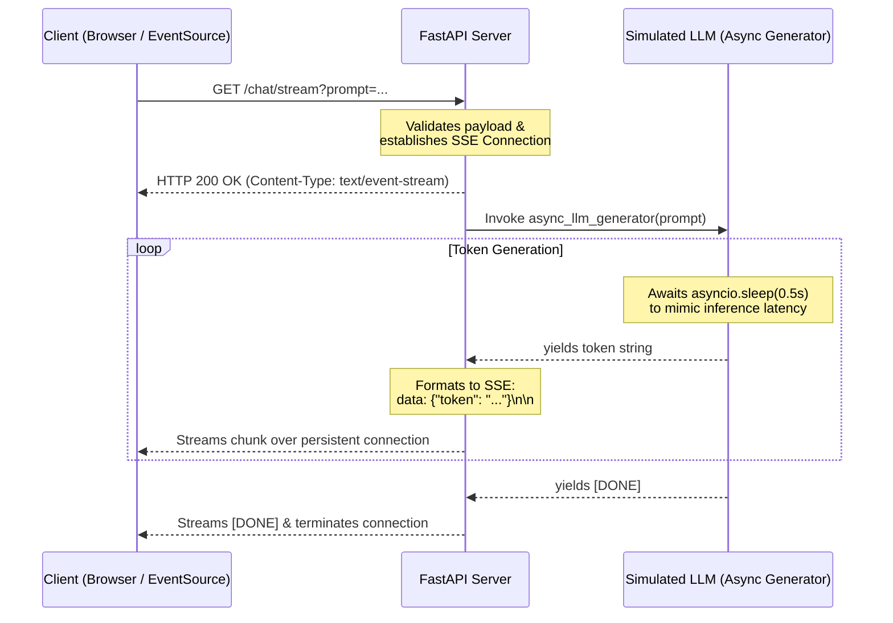

# FastAPI Learning Project

This repository documents my journey into understanding and utilizing FastAPI, specifically focusing on its critical role in the modern AI engineering ecosystem.

## What is FastAPI?

FastAPI is a modern, fast (high-performance) web framework for building APIs with Python. It has dominated the AI ecosystem for three main reasons:
1. **Async by Default:** AI apps spend a lot of time waiting on network calls (LLMs, Vector DBs). FastAPI uses `async`/`await` to handle thousands of concurrent requests without blocking.
2. **Pydantic Validation:** It automatically validates incoming complex JSON payloads (like prompts or metadata) before the core logic even runs.
3. **Auto Documentation:** Interactive Swagger UI docs (`/docs`) are generated automatically.

## Always ask for the 4 questions
- Endpoint : GET or POST or what
- Payload: what its expected to carry
- Workflow : how it should work ,is it async ,or sync or static
-Constraint : what could be the limit ,or tradeoff

## Challenges Addressed

I tackled two specific challenges in this project to learn core AI Engineering concepts:

### 1. Incorporating a Strict JSON Pydantic Model
**Challenge:** How to build an API that accepts a complex POST request payload (like a resume) and strictly validates its data types and constraints before the core logic runs.
- **Implementation:** Leveraged Pydantic's `BaseModel` and `Field` to enforce constraints (e.g., name cannot be empty, positive integers).
- **Codebase Link:** Implemented in [`strict_json_gateway.py`](strict_json_gateway.py) (Reference: [`docs/task_01_strict_json.md`](docs/task_01_strict_json.md))

### 2. Mimicking Production LLM Streaming
**Challenge:** In production, LLMs take time to generate tokens. Making a user stare at a loading wheel is bad UX. The challenge was to mimic how an LLM streams text chunk-by-chunk back to the client in real-time.
- **Implementation:** Built an asynchronous generator using `asyncio.sleep()` to simulate dummy latency and used FastAPI's `StreamingResponse` to serve Server-Sent Events (SSE).
- **Codebase Link:** Initial dummy attempt in [`llm_streamer.py`](llm_streamer.py), and the fully refactored, robust version in [`refac_llm_streamer.py`](refac_llm_streamer.py) (Reference: [`docs/task_02_llm_streaming.md`](docs/task_02_llm_streaming.md))

## Architecture: Real-time LLM Streaming Simulation

To understand how the backend mimics a production LLM streaming pipeline, consider the following architecture. At a high level, instead of returning a massive payload at the end of a process, the server keeps the HTTP connection open and utilizes an asynchronous generator to push chunks of data (tokens) to the client as soon as they are "generated" (simulated via `asyncio.sleep`).

## Technical Documentation & Learnings

To keep this README concise, detailed technical documentation has been separated into the `docs/` directory. Here is a brief overview of the key takeaways:
- **FastAPI & Async I/O:** Leveraged for non-blocking concurrency, crucial for LLM response latency.
- **Data Contracts:** Used Pydantic for strict schema validation at the API boundary.
- **Server-Sent Events (SSE):** Implemented for real-time token streaming to improve UX.
- **Resilient Error Handling:** Handled stream failures gracefully without breaking the HTTP protocol.

For an in-depth dive, please refer to the following documents:
- [Core Architectural Learnings](docs/learnings_summary.md)
- [Implementation Results](docs/results.md)
- [Pythonic Patterns & Anti-Patterns](docs/python_syntax_guide.md)
